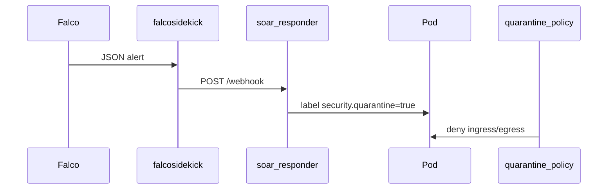
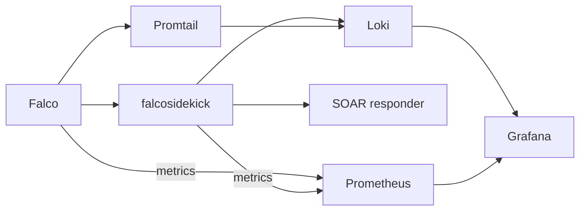

# Architecture

## Stack overview

k8s-soar delivers a layered security stack on bare-metal Kubernetes:

| Layer | Component | Role |
|-------|-----------|------|
| Bootstrap | Ansible + kubeadm | Bare-metal cluster provisioning |
| Network | Cilium | eBPF CNI, network policies, Hubble observability |
| Detect | Falco | Syscall-level runtime threat detection (modern eBPF) |
| Enforce | Tetragon | Kernel TracingPolicies — process/network actions |
| Prevent | Kyverno | Admission policies-as-code |
| Respond | falcosidekick + SOAR responder | Detect → Isolate webhook workflow |
| Observe | Grafana + Prometheus + Loki | Findings dashboards, metrics, Loki alerts |

## Install flow

```text
Bare metal servers ──► Ansible (kubeadm) ──► Helm (k8s-soar) ──► policies ──► scenarios
```

After `kubeadm init`, nodes are NotReady until Helm installs Cilium as the pod network.

## Design decisions

- **Cilium as single CNI** — installed immediately after kubeadm; no Flannel/Calico.
- **Policies bundled in Helm** — sourced from `policies/` via chart templates.
- **Single install path** — bare-metal bootstrap only; no brownfield/k3s/kind variants.

## SOAR flow



## Observability flow


